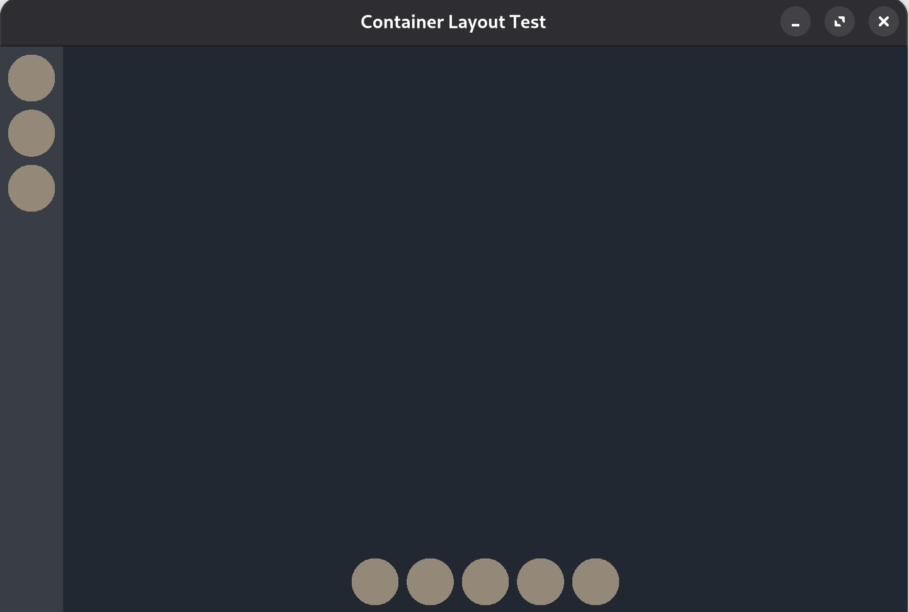

# UILO Design Overview

**Project Name:** UILO (pronounced *wee-low*)  
**Technology:** C++20, SFML 3.0.1
**Framework Type:** Retained-Mode UI Framework  
**Design Goals:** Declarative, minimal setup, explicit ownership, layout-first design

---

## Core Features

- Retained-mode hierarchy using `Row` and `Column` containers
- Memory-safe: UI objects are heap-allocated and tracked with `std::unique_ptr`
- Layout and interaction defined via fluent `Modifier` API
- Optional support for user-supplied SFML windows (`sf::RenderWindow`)
- Built-in widgets like `Button`, `Spacer`, and (WIP) `Text`
- Strict click handling with top-down delegation and visibility checks
- Page-based view switching with `UILO::switchToPage`

---

## Element System

Every UI component derives from `Element`. Layout logic and rendering are handled recursively.

```cpp
uilo::Row* myRow = uilo::row(
    uilo::Modifier().setfixedHeight(50).setColor(sf::Color::Red),
    {
        uilo::button(
            uilo::Modifier()
                .setfixedWidth(100)
                .align(uilo::Align::CENTER_Y)
                .onClick([]() { std::cout << "Clicked!\n"; }),
            uilo::ButtonStyle::Pill,
            "OK"
        )
    }
);
```

---

## Containers

### `Row` and `Column`

- `Row` arranges children left to right
- `Column` arranges children top to bottom
- Children can align using `Align` bitmask (`LEFT`, `CENTER_X`, `RIGHT`, etc.)
- Each alignment group is measured and laid out independently
- Containers can be nested arbitrarily

---

## Modifier API

Used to declaratively configure layout, visuals, and interactivity:

### Fluent Interface

```cpp
uilo::Modifier()
    .setfixedWidth(120)
    .setfixedHeight(40)
    .align(uilo::Align::CENTER_X | uilo::Align::TOP)
    .setColor(sf::Color::Blue)
    .onClick([]() { std::cout << "Button pressed\n"; });
```

### Supported Options

| Modifier Method         | Description                        |
|-------------------------|------------------------------------|
| `.setWidth(pct)`        | Set width as % of parent           |
| `.setfixedWidth(px)`    | Set fixed pixel width              |
| `.setHeight(pct)`       | Set height as % of parent          |
| `.setfixedHeight(px)`   | Set fixed pixel height             |
| `.align(Align)`         | Bitmask-based alignment            |
| `.setColor(color)`      | Background fill color              |
| `.onClick(callback)`    | Click handler                      |
| `.setVisible(bool)`     | Show/hide element                  |

---

## Built-in Elements

| Element     | Description                                |
|-------------|--------------------------------------------|
| `Button`    | Interactive rectangle or pill-style button |
| `Spacer`    | Empty space-filler for layout              |
| `Text`      | Placeholder for future text support        |

---

## Window Management

### Self-Managed Window

```cpp
uilo::UILO ui("Demo", {{
    uilo::page({ uilo::row(/*...*/) }), "main"
}});
```

### User-Managed Window

```cpp
sf::RenderWindow myWindow(...);
sf::View myView(...);

uilo::UILO ui(myWindow, myView, {{
    uilo::page({ uilo::column(/*...*/) }), "main"
}});
```

UILO will render to either your own window or manage one itself. Layout resizes automatically.

---

## Pages and Navigation

UILO supports multiple pages and switching between them by name:

```cpp
auto mainPage = uilo::page({ uilo::row(/*...*/) });
auto settingsPage = uilo::page({ uilo::column(/*...*/) });

ui.addPages({ {mainPage, "main"}, {settingsPage, "settings"} });
ui.switchToPage("settings");
```

---

## Memory Management

- All UI elements are created using the `uilo::obj()` factory, wrapped in `std::unique_ptr`
- Ownership is automatically handled and cleared on destruction
- Pages are also tracked internally with unique pointers
- Manual deletion of tracked objects is prevented and will abort with an error

---

## Event and Click Handling

- Events are polled internally in `update()`
- Mouse clicks are mapped to the view and passed to the current page
- Clicks are routed top-down to the most deeply nested visible element

---

## Class Hierarchy

```
       Element
          |
    +-----+--------+
    |              |
 Container       Button
    |
 +--+---+
 |      |
Row   Column

Spacer, Text (WIP) also extend Element
```

---

## Getting Started

### Basic Usage:

```cpp
uilo::UILO ui("Example", {{
    uilo::page({
        uilo::column(
            uilo::Modifier().setColor(sf::Color(40, 40, 40)),
            {
                uilo::button(
                    uilo::Modifier()
                        .setfixedWidth(150)
                        .setfixedHeight(40)
                        .align(uilo::Align::CENTER_X)
                        .onClick([](){ std::cout << "Hi\n"; }),
                    uilo::ButtonStyle::Rect,
                    "Click Me"
                )
            }
        )
    }), "main"
}});

while (ui.isRunning()) {
    ui.update();
    ui.render();
}
```
---
# Screenshots of current progress



---
