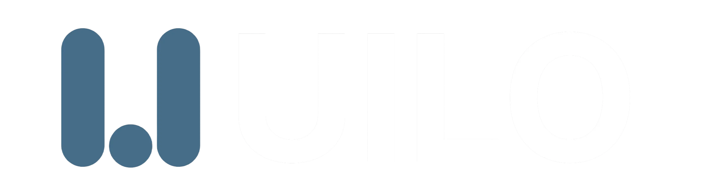

# UILO

A lightweight, modern C++20 UI library with fast, hardware-accelerated rendering powered by **bgfx** and **SDL3**.

## Overview

UILO provides a retained-mode UI system with automatic layout management, responsive containers, and a clean declarative API. Build cross-platform applications with composable widgets, flexible alignment, and event handling — all in pure C++.

Elements are created with lowercase factory functions and configured with two objects: a `Modifier` for anything every element shares (size, alignment, events) and a widget-specific `Options` for how that one widget looks. Colours can be given literally or as a **palette role**, resolved at draw time, so swapping the palette restyles the whole app.

**Licensed under MPL-2.0.**

## Features

- **Retained-mode UI** — elements persist between frames and only re-layout when something changes
- **Automatic layout** — rows, columns, grids and canvases with percent or pixel sizing
- **Hardware accelerated** — bgfx over Metal, Vulkan, D3D11 or OpenGL
- **Cross-platform** — macOS, Linux and Windows; see [IOS_BUILD.md](IOS_BUILD.md) for iOS
- **Themed by role** — a `Palette` maps role names to colours and gradients; `Theme` sets library-wide defaults
- **Nothing to ship beside the binary** — two fonts and ~280 icons are compiled in
- **Real widgets** — text, buttons, sliders, knobs, dropdowns, textboxes, images, SVG icons, waveforms, file browser, date picker, resizers, and a working **terminal**
- **Optional web backend** — the same element tree served through Wt (`-DUILO_WT=ON`)
- **Integrated build** — vendored dependencies, one-command builds

## Build

### Requirements

- **macOS:** Xcode command-line tools (clang)
- **Linux:** gcc or clang, plus the usual X11/Wayland dev packages SDL3 needs
- **Windows:** Visual Studio 2022 build tools (use `build.ps1`)
- **All platforms:** CMake 3.20+, Python 3, and Git (dependencies are cloned)

### Quick Start

```bash
./build.sh                  # Release, static
./build.sh debug            # Debug, static
./build.sh release dynamic  # Release, shared
./build.sh clean            # Clean build/ (preserves vendor cache)
UILO_CLEAN_EXT=1 ./build.sh # Force rebuild of dependencies
```

The build script:

- Clones and caches SDL3 at `.sdl3build/` (one-time)
- Clones and builds bgfx + tools at `ext/bgfx/` (one-time)
- Compiles the shaders for every backend the platform supports
- Configures and builds UILO via CMake
- Outputs binaries to `build/{Release,Debug}-{static,dynamic}/`

Examples build into `examples/bin/`. Run them **from `examples/`**, since a few load files by relative path:

```bash
cd examples && ./bin/containers
```

## Hello, UILO

A complete program. UILO owns no window of its own: you create a `Renderer`, hand it to `UILO` along with a root `Page`, and drive the frame yourself.

```cpp
#include <UILO.hpp>

using namespace uilo;

int main() {
    Renderer renderer;
    renderer.init(900, 600, "Hello");

    UILO uilo(renderer, page(
        column(
            Modifier()
                .setWidth(100_pct)
                .setHeight(100_pct),
            ColumnOptions()
                .setColorRole("bg"),
            contains{
                text(
                    Modifier()
                        .setWidth(100_pct)
                        .setHeight(100_pct),
                    TextOptions()
                        .setContent("Hello, UILO")
                        .setCharSize(28)
                        .setTextAlignX(Align::CenterX)
                        .setTextAlignY(Align::CenterY)
                ),
            }
        ),
        "main"
    ));

    Palette palette;
    palette.set("bg", Color::fromHex("#1b1b1f"));
    uilo.setPalette(palette);
    uilo.setScale(OS::scale());

    while (uilo.isRunning()) {
        uilo.pollEvents();
        uilo.update();

        renderer.beginFrame();
        renderer.clear();
        uilo.render();
        renderer.endFrame();
    }

    return 0;
}
```

Two details worth knowing up front:

- **`uilo.setScale(OS::scale())`** — layout is in points; this is what makes it correct on a HiDPI display. Skip it and everything comes out half size.
- **No font was set.** Text with no font uses the DejaVu Sans compiled into the binary, so this program needs no asset files at all.
- **Two kinds of alignment.** `Modifier::setAlign` places an element's box inside
  its parent; `TextOptions::setTextAlignX/Y` places the text inside that box.
  Centring text needs the second, which is why the label above fills its slot and
  centres within it.

## Core Concepts

### Modifier — position, size and events

`Modifier` carries what every element shares: where it sits and how big it is, plus its callbacks. Anything about how an element *looks* — padding included — belongs to its Options.

```cpp
Modifier()
    .setWidth(50_pct)                      // 50% of the space left by fixed siblings
    .setHeight(100_px)
    .setAlign(Align::CenterX | Align::Top) // one flag per axis, OR'd
    .setCursor(CursorType::Hand)           // while the pointer is over it
    .setOnLeftClick([](Element* e)  { /* ... */ })
    .setOnHoverEnter([](Element* e) { /* ... */ })
    .setVisible(true)
```

Callbacks can take the concrete type, which saves a cast:

```cpp
Modifier().setOnHoverEnter([](Icon* i) { i->getOptions().setColorRole("accent"); })
```

There is no `Align::Center`: combine `Align::CenterX | Align::CenterY`.

### Options — per-widget styling

Each widget has its own Options for its own properties. Colours come in pairs — a literal and a role — where the role wins if it resolves against the active palette:

```cpp
TextOptions()
    .setContent("Hello World")
    .setFont(Resources::fonts::mono)   // or a path to a .ttf
    .setCharSize(16)
    .setColorRole("text")
    .setBold(true)
    .setWrap(true)

ButtonOptions()
    .setColorRole("accent")
    .setRounding(8.f)
    .setLabel(text(Modifier().setAlign(Align::CenterX | Align::CenterY),
                   TextOptions().setContent("Click me")))

SliderOptions()
    .setRange(0.f, 100.f)
    .setStep(1.f)
    .setOrientation(SliderOrientation::Horizontal)
    .setOnValueChanged([](float v) { /* ... */ })
```

### Padding

Both kinds live in the Options, not the Modifier — not every element can hold
content, so keeping the outer one on `Modifier` and the inner one on Options
would split one idea across two objects.

```cpp
RowOptions()
    .setOuterPadding(8.f)   // space outside the row, inside the slot its parent gave it
    .setInnerPadding(12.f)  // space between the row's edge and its children
```

- **Outer padding** shrinks the element within its own slot, so it never displaces
  a sibling. Every Options has it.
- **Inner padding** insets the element's content. Only elements that hold content
  have it: the containers (`Row`, `Column`, `Canvas`), `Button` (its label),
  `Text`, `Image`, `Icon`, and `FileBrowser`. `Textbox`, `Terminal`, `DatePicker`
  and `DateField` have it too, where `setPadding` is kept as an alias for the
  same thing.

They compose: an inner padding of 10 on a column plus an outer padding of 5 on a
child puts that child 15 from the column's edge. Neither moves the container
itself — its background, outline and hit area still use its full bounds.

Both fall back to `Theme::setOuterPadding()` / `Theme::setInnerPadding()` when
unset, and `clearOuterPadding()` / `clearInnerPadding()` return an element to
following the theme.

### Dimension literals

```cpp
Modifier().setWidth(100_px);   // pixels
Modifier().setWidth(50_pct);   // percent of the space left by fixed siblings
```

Percent children split what remains once every fixed sibling has taken its size, so a `100_px` header and a `100_pct` body fill a column exactly.

### Built-in fonts and icons

Both are compiled into the library, so a UILO binary renders text and icons with no files beside it.

```cpp
text({}, TextOptions());                                    // DejaVu Sans (implicit default)
text({}, TextOptions().setFont(Resources::fonts::regular));
text({}, TextOptions().setFont(Resources::fonts::mono));    // Droid Sans Mono

icon({}, IconOptions().setIcon(Resources::icons::settings)); // ~280 Feather icons
```

`Resources::icons::` and `Resources::fonts::` are compile-time names, so a typo is a build error rather than a blank widget. Register your own under a name if you prefer:

```cpp
Resources::get().fontRegistry().add("ui", "assets/fonts/Inter.ttf");
text({}, TextOptions().setFont("ui"));
```

See [THIRD_PARTY.md](THIRD_PARTY.md) for the licences of what ships inside the binary.

### Palette and Theme

A `Palette` maps role names to colours. Because roles resolve when an element draws, changing the palette restyles everything that referenced a role — no element has to be rebuilt.

```cpp
void applyTheme(UILO& app) {
    Palette palette;
    palette.set("bg",     Color::fromHex("#1b1b1f"));
    palette.set("panel",  Color::fromHex("#242429"));
    palette.set("accent", Color::fromHex("#7ad0a0"));
    palette.setAlias("panelHover", "accent");
    palette.setGradient("hero", Gradient().setTop(Color{97, 62, 180})
                                          .setBottom(Color{34, 27, 58}));
    app.setPalette(palette);

    Theme::current().setRounding(8.f);   // library-wide default for anything unset
}
```

### Gradients

A `Gradient` is a per-corner fill. Each corner takes a `Color` **or** a role name, and the two mix freely:

```cpp
Color c1{97, 62, 180}, c2{58, 40, 120}, c3{34, 27, 58}, c4{20, 16, 34};

// Vertical fade
Gradient vertical = Gradient().setTop(c1).setBottom(c3);

// Horizontal, driven by palette roles, so it follows the active theme
Gradient themed = Gradient().setLeft("accent").setRight("panel");

// Four explicit corners
Gradient corners = Gradient().setTopLeft(c1).setTopRight(c2)
                             .setBottomLeft(c3).setBottomRight(c4);

// A literal and a role mix freely
Gradient mixed = Gradient().setTop(Color::Red).setBottom("panel");
```

`setTop`/`setBottom`/`setLeft`/`setRight` each set both corners of an edge. Apply one with `setGradient(...)` on any container or button Options; it composes with `setRounding`.

### Containers

```cpp
column(
    Modifier().setWidth(100_pct).setHeight(100_pct),
    ColumnOptions().setColorRole("bg"),
    contains{
        row(Modifier().setHeight(48_px), RowOptions().setColorRole("panel"), contains{}),
        column(Modifier().setHeight(100_pct),                    // takes what's left
               ColumnOptions().setScrollable(true).setScrollSpeed(50.f),
               contains{ /* ... */ }),
    }
)
```

`contains{...}` is the child list. `Canvas` positions children freely instead of stacking them, and `Grid` lays them out in cells.

## A page worth looking at

An editor-shaped layout: an icon rail, a file browser, a draggable divider, a code editor with line numbers, and a live terminal along the bottom. This is close to `examples/text-editor.cpp`.

```cpp
Container* buildEditor() {
    return row(
        Modifier().setWidth(100_pct).setHeight(100_pct),
        RowOptions().setColorRole("bg"),
        contains{
            /* Icon rail. Each icon recolours on hover and shows a hand cursor. */
            column(
                Modifier().setWidth(48_px).setHeight(100_pct),
                ColumnOptions().setColorRole("panel"),
                contains{
                    icon(
                        Modifier()
                            .setWidth(28_px)
                            .setHeight(28_px)
                            .setAlign(Align::CenterX | Align::Top)
                            .setCursor(CursorType::Hand)
                            .setOnHoverEnter([](Icon* i) { 
                                i->getOptions().setColorRole("accent"); 
                            })
                            .setOnHoverExit([](Icon* i)  { 
                                i->getOptions().setColorRole("dim"); 
                            }),
                        IconOptions()
                            .setIcon(Resources::icons::file)
                            .setColorRole("dim")
                    ),
                }
            ),

            /* File browser, rooted anywhere on disk. */
            filebrowser(
                Modifier().setWidth(240_px).setHeight(100_pct),
                FileBrowserOptions()
                    .setRootPath(".")
                    .setScrollSpeed(50.f)
            ),

            /* Drag to resize the browser. Bounds are a percentage of the row. */
            resizer(
                Modifier().setWidth(8_px),
                ResizerOptions()
                    .setDirection(ResizerDir::Left)
                    .setResizeWidthMin(15_pct)
                    .setResizeWidthMax(50_pct)
            ),

            column(
                Modifier().setWidth(100_pct).setHeight(100_pct),
                ColumnOptions(),
                contains{
                    /* A code editor: monospaced, top-aligned, line numbers. */
                    textbox(
                        Modifier().setWidth(100_pct).setHeight(100_pct),
                        TextboxOptions()
                            .setMultiline(true)
                            .setWrap(false)
                            .setFont(Resources::fonts::mono)
                            .setCharSize(15)
                            .setShowLineNumbers(true)
                            .setLineNumberBold(true)
                            .setCurrentLineNumberColorRole("accent")
                            .setTextAlignX(Align::Left)
                            .setTextAlignY(Align::Top)
                            .setSelectionColorRole("selection")
                    ),

                    resizer(
                        Modifier().setHeight(8_px),
                        ResizerOptions()
                            .setDirection(ResizerDir::Bottom)
                            .setResizeHeightMax(60_pct)
                    ),

                    /* A real shell. Drag to select, Cmd+C / Cmd+V to copy and
                       paste, and it resizes the shell with the widget. */
                    terminal(
                        Modifier().setWidth(100_pct).setHeight(240_px),
                        TerminalOptions()
                            .setFont(Resources::fonts::mono)
                            .setCharSize(14)
                            .setBackgroundColorRole("termBg")
                            .setCursorColorRole("accent")
                            .setScrollback(5000)
                            .setOnExit([] { /* shell quit */ })
                    ),
                }
            ),
        }
    );
}
```

### Reacting to state

Elements are long-lived, so a callback mutates the element it captured rather than rebuilding a tree:

```cpp
Text* status = text({}, TextOptions().setContent("idle"));

auto* go = button(
    Modifier()
        .setWidth(120_px)
        .setHeight(32_px)
        .setCursor(CursorType::Hand)
        .setOnLeftClick([status](Element*) { 
            status->setString("running…"); 
        }),
    ButtonOptions()
        .setColorRole("accent")
        .setRounding(6.f)
);
```

`setOnUpdateStart` / `setOnUpdateEnd` run every frame, which is where per-frame animation goes — `Resizer` fades in `examples/text-editor.cpp` are done this way, using `getDeltaTime()`.

### Floating elements and overlays

Anything positioned in window space rather than in the layout:

```cpp
void addPanel(UILO& app) {
    app.addFloating(freeColumn(
        Modifier()
            .setWidth(220_px)
            .setHeight(120_px)
            .setFreePosition({40.f, 40.f}),
        ColumnOptions()
            .setColorRole("panel")
            .setRounding(8.f),
        contains{ /* ... */ }
    ));
}
```

The floating layer is the only thing ticked, hit-tested and drawn above the page, which is how popups (the `Dropdown` list, the `DatePicker` calendar) stay on top.

## Key APIs

### UILO (application)

```cpp
UILO(Renderer& renderer, Page* page);

void pollEvents();
void update();
void render();
bool isRunning() const;
void quit();

void addPage(Page* page);            // takes ownership; Page carries its own name
void setPage(const std::string& pageName);
void setActivePage(Page* page);      // without taking ownership

void setPalette(const Palette&);
void setScale(float scale);          // pair with OS::scale()

Element* addFloating(FreeElement f);
void     removeFloating(Element* e);
void     registerOverlay(Element* e, std::function<void()> onDismiss = {});

void setOnLiveResize(std::function<void()> cb);  // keep drawing during a drag

float getScale()        const;
float getDeltaTime()    const;
float getFrameRate()    const;
float getAvgFrameRate() const;
Keybinds&   getKeybinds();
Mousebinds& getMousebinds();
```

### Modifier methods

```cpp
.setWidth(Dimension)     .setHeight(Dimension)    .setAlign(Align)
.setVisible(bool)        .ignoreScroll(bool)      .setFreePosition(Vec2f)
.setCursor(CursorType)   .clearCursor()           .setMaterial(Material)

.setOnLeftClick(cb)      .setOnRightClick(cb)
.setOnHoverEnter(cb)     .setOnHoverExit(cb)      .setOnHover(cb)
.setOnScroll(cb)         .setOnUpdateStart(cb)    .setOnUpdateEnd(cb)
```

### Factories

```cpp
Page*        page(Container* root, const std::string& name);

Column*      column(Modifier, ColumnOptions, contains children, name);
Row*         row(Modifier, RowOptions, contains children, name);
Canvas*      canvas(Modifier, CanvasOptions, contains children, name);

Text*        text(Modifier, TextOptions, name);
Icon*        icon(Modifier, IconOptions, name);
Image*       image(Modifier, ImageOptions, name);
Spacer*      spacer(Modifier, SpacerOptions, name);
Waveform*    waveform(Modifier, WaveformOptions, name);

Button*      button(Modifier, ButtonOptions, name);
Slider*      slider(Modifier, SliderOptions, name);
Knob*        knob(Modifier, KnobOptions, name);
Dropdown*    dropdown(Modifier, DropdownOptions, {items...}, name);
Textbox*     textbox(Modifier, TextboxOptions, name);
Resizer*     resizer(Modifier, ResizerOptions, name);
Terminal*    terminal(Modifier, TerminalOptions, name);
FileBrowser* filebrowser(Modifier, FileBrowserOptions, name);
DatePicker*  datepicker(Modifier, DatePickerOptions, name);
DateField*   datefield(Modifier, DateFieldOptions, name);

FreeElement  freeColumn(Modifier, ColumnOptions, contains children, name);
FreeElement  freeRow(Modifier, RowOptions, contains children, name);
```

Every argument has a default, so `text({}, TextOptions().setContent("hi"))` is valid and the trailing name is optional. Elements are `new`-allocated and owned by UILO — it sweeps them between frames, so you never delete one yourself.

Full generated reference for every type and function: **[docs/](docs/)** (regenerate with `python3 tools/gen_docs.py`).

## Examples

| Example | What it shows |
| --- | --- |
| `containers.cpp` | nesting, alignment, scrolling, gradients |
| `text-editor.cpp` | file browser, resizers, code editor, terminal |
| `terminal.cpp` | a shell in a window, with live-resize wired up |
| `datepicker.cpp` | date picker and date field |
| `gradients.cpp` | per-corner and role-driven gradients |
| `theme.cpp` | palette roles and `Theme` defaults |
| `glass_trail_test.cpp` | `Material` blur / glass |
| `render_bench.cpp` | throughput benchmark |

## Dependencies

UILO vendors and manages all dependencies:

- **SDL3** — window, input, event handling
- **bgfx / bx / bimg** — rendering backend and utilities
- **stb_truetype** — glyph rasterisation
- **NanoSVG** — SVG icon parsing
- **Wt** — only for the optional web backend (`-DUILO_WT=ON`)

All are cloned into `ext/` and built once, then cached. Clean builds don't rebuild them. Licences are listed in [THIRD_PARTY.md](THIRD_PARTY.md) — note the Wt backend is GPL, so leave it off unless you intend that.

## Performance

- **One-time dependency builds**, cached between clean builds
- **Dirty-tracked layout** — elements re-layout only when something changed
- **Run-merged text** — a row of same-styled glyphs becomes one draw call
- **Hardware accelerated** — bgfx with minimal overhead

## License

UILO is licensed under the Mozilla Public License 2.0 (MPL-2.0). See [License.txt](License.txt) for details.
